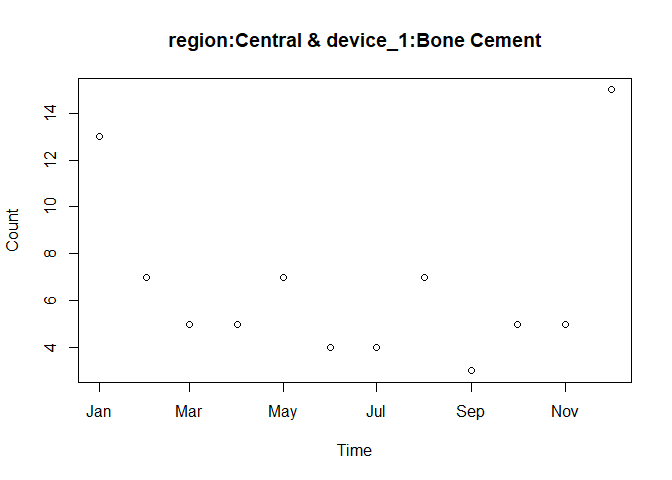

<!-- README.md is generated from README.Rmd. Please edit that file -->
Why Use `mds`?
--------------

Medical device event data are messy.

Common challenges include:

-   Performing ongoing surveillance on messy data
-   Quickly answering simple questions such as:
    -   Are events trending up?
    -   How did my trends look 1 year ago? 2 years ago?
-   Incompatibility of various sources of device-events
-   Difficulty integrating exposures, a.k.a. denominator data
-   Understanding all the possible combinations to analyze
-   Application of disproportionality analysis (DPA)
-   Documentation of analyses in a auditable, reproducible way

How Do I Use `mds`?
-------------------

The `mds` package provides a standardized framework to address these challenges:

-   Standardize events involving medical devices
-   Standardize exposures of the device (also known as opportunities for an event to occur, or event denominator)
-   Enumerate possible analyses in a flexible way
-   Generate times series of analyses for trending over time
-   Set up analyses for easy application of disproportionality analysis (DPA)
-   Save all files in lightweight `R` files for auditability, documentation, and reproducibility

**Note on Statistical Algorithms**

`mds` data and analysis standards allow for seamless application of various statistical trending algorithms via the `mdsstat` package (under development).

Raw Data to Trending in 4 Steps
-------------------------------

The general workflow to go from data to trending over time is as follows:

1.  Use `deviceevent()` to standardize device-event data.
2.  Use `exposure()` to standardize exposure data (optional).
3.  Use `define_analyses()` to enumerate possible analysis combinations.
4.  Use `time_series()` to generate counts (and/or rates) by time based on your defined analyses.

### Live Example

``` r
library(mds)

# Step 1 - Device Events
de <- deviceevent(
  maude,
  time="date_received",
  device_hierarchy=c("device_name", "device_class"),
  event_hierarchy=c("event_type", "medical_specialty_description"),
  key="report_number",
  covariates="region",
  descriptors="_all_")

# Step 2 - Exposures (Optional step)
ex <- exposure(
  sales,
  time="sales_month",
  device_hierarchy="device_name",
  match_levels="region",
  count="sales_volume")

# Step 3 - Define Analyses
da <- define_analyses(
  de,
  device_level="device_name",
  exposure=ex,
  covariates="region")

# Step 4 - Time Series
ts <- time_series(
  da,
  deviceevents=de,
  exposure=ex)
```

Plot Time Series of Counts and Rates
------------------------------------

``` r
plot(ts[[1]])
plot(ts[[4]], "rate", type='l')
```


